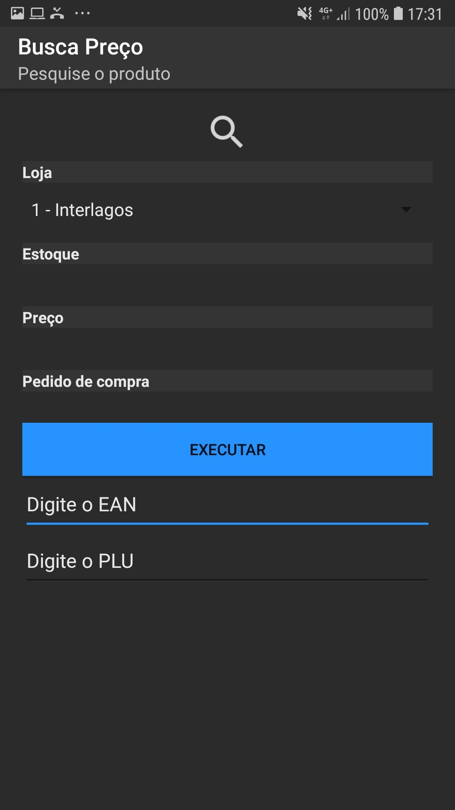
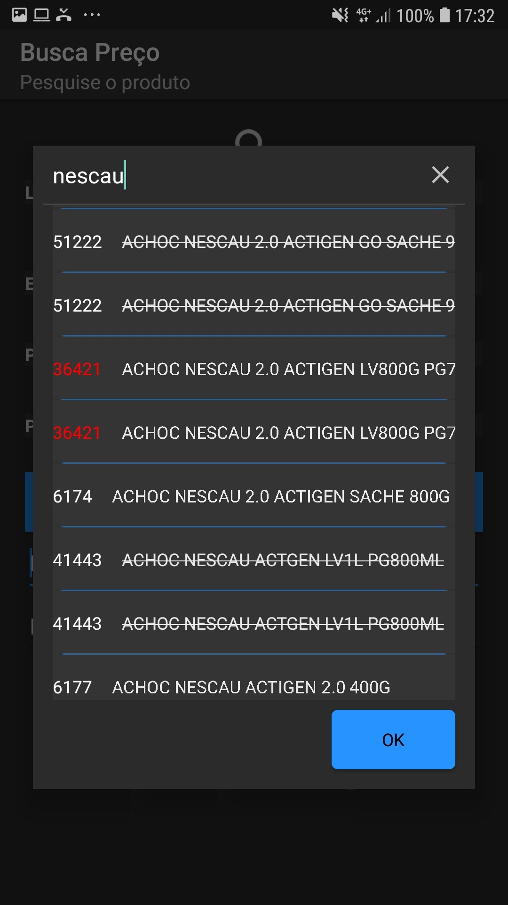
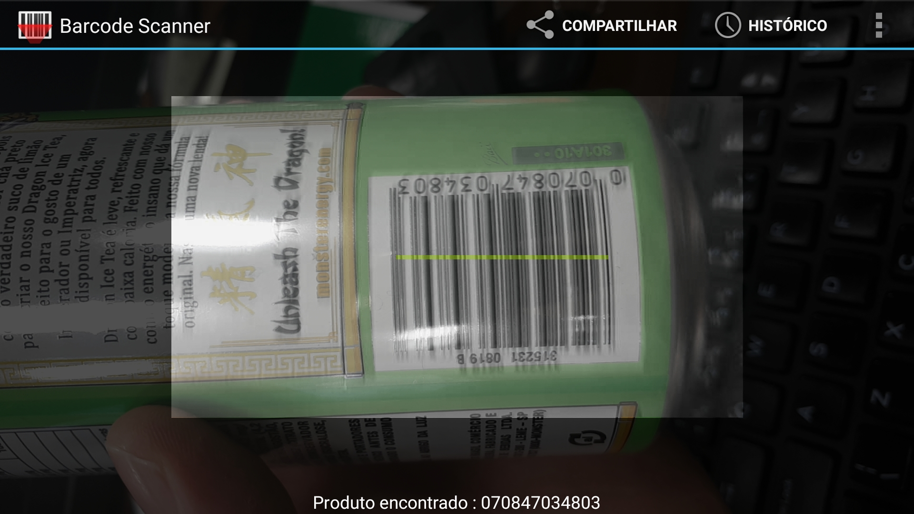
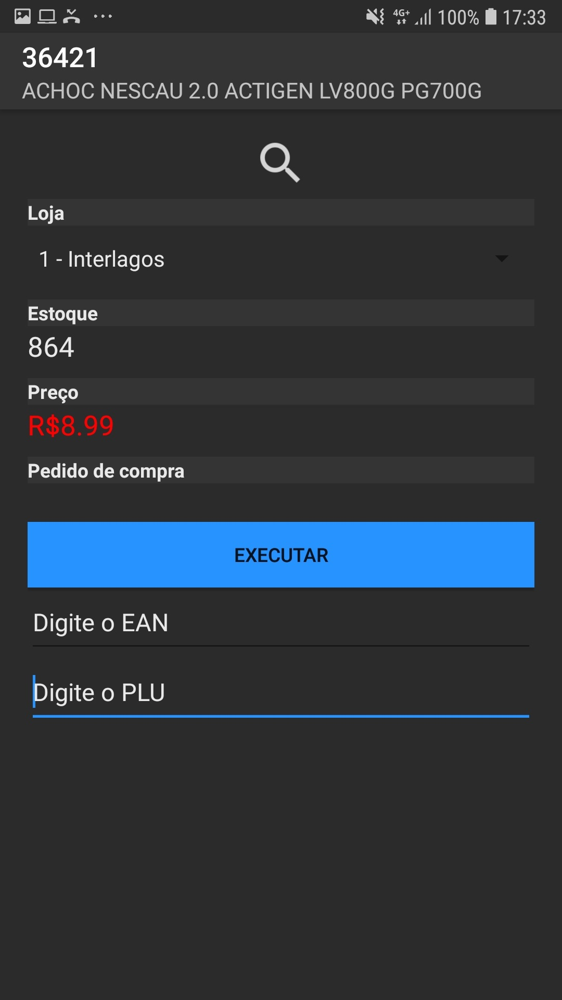

# Busca Preço!
Aplicação para verificar preço, quantidade em estoque e preço promocional de produtos. 
# Tela Principal
Necessita de login para controlar quem acessa preço e estoque pra cada loja separada. 
Só irá aparecer a loja para usuários habilitados para aquela loja especifica. 
Pode ser feita a consulta do produto pelo PLU (codigo do produto), ou digitando o codigo EAN. 
 
# Busca por Descrição
A busca do produto também pode ser feita pela descrição. 
Quando o PLU aparece em vermelho significa que o produto está em promoção. 
Com a descrição riscada o produto está desativado para vendas. 
 
# Busca por Codigo de Barras
A busca pelo codigo de barras inicia assim que preciona o botão de executar sem inserir um PLU ou EAN. 
Irá abrir a aplicação Barcode Scanner, que deve estar prevamente instalada. 
Assim que a aplicação ler o codigo, o Busca Preço irá retornar as informações do produto. 
 
# Informações do Produto
Após buscar por PLU, EAN, descrição ou pelo codigo de barras as informações do produto irão aparecer. 
Preço em vermelho é de valor promocional, estoque em vermelho indica que o estoque tem valores menores que 1. 
 
